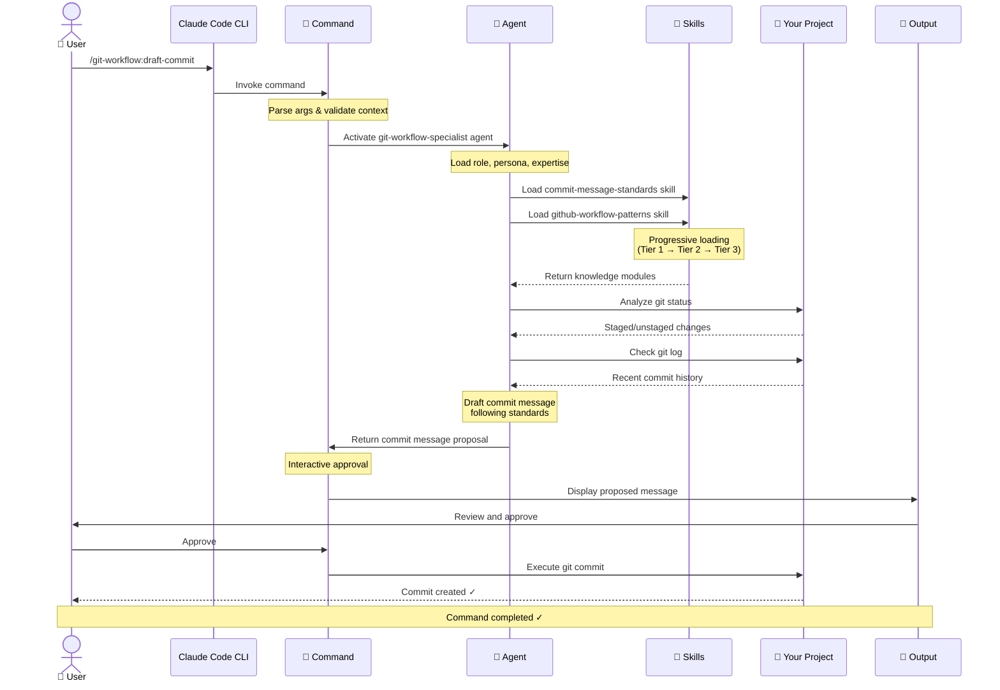

# ⚡️ Using Brad's Marketplace

**Brad's Marketplace** provides a collection of Claude Code **agents**, **skills**, and **commands** that accelerate software development through workflow automation, documentation generation, and productivity tools.

This guide walks through how to install the marketplace plugins and use them in your daily workflow.

## 🧭 Quick Navigation

- **[Architecture Guide](./architecture.md)** - Design principles and component relationships
- **[Plugins](./capabilities/plugins.md)** - What plugins are and how they work
- **[Agents](./capabilities/agents.md)** - Domain expert personas
- **[Skills](./capabilities/skills.md)** - Reusable knowledge modules
- **[Commands](./capabilities/commands.md)** - User-facing workflows and syntax

## 🧩 Installation

```bash
# Add the marketplace via GitHub
claude plugin marketplace add https://github.com/bradleyboehmke/brads-marketplace

# Or from a local directory
claude plugin marketplace add /path/to/brads-marketplace

# Install the desired plugins
claude plugin install git-workflow@brads-marketplace
claude plugin install document-generator@brads-marketplace
claude plugin install marketplace-dev@brads-marketplace
claude plugin install note-taker@brads-marketplace
claude plugin install course-builder@brads-marketplace

# Start Claude and view the available plugins
claude
/plugin list
```

> 💡 **Tip:** You can install all plugins or just the ones you need. Each plugin adds its own agents, skills, and commands to your Claude Code environment.

## 🔄 How the Marketplace Works

The following diagram shows the end-to-end flow when using a marketplace plugin, from command invocation through analysis to final output delivery.



**Understanding the Flow:**

1. **User invokes a command** - Slash command with optional parameters
2. **Command loads the agent** - Activates domain expert with specific expertise
3. **Agent loads skills** - Pulls in required knowledge modules using progressive disclosure
4. **Agent analyzes project** - Uses skill knowledge to examine context and draft output
5. **Command handles interaction** - Manages user approval, file operations, or git commands

This architecture ensures:
- **Consistency** - Same agent expertise applied across different commands
- **Reusability** - Skills shared across multiple agents and plugins
- **Efficiency** - Progressive loading minimizes token usage
- **Flexibility** - Interactive workflows with user control

## 📦 Available Plugins

| Plugin | Description | Commands |
|--------|-------------|----------|
| **git-workflow** | Enforce standard Git and GitHub collaboration practices with automated workflow assistance | `/git-workflow:create-branch`<br>`/git-workflow:draft-commit`<br>`/git-workflow:draft-pr`<br>`/git-workflow:pre-commit-check`<br>`/git-workflow:spec-issue`<br>`/git-workflow:validate-commit`<br>`/git-workflow:validate-pr` |
| **document-generator** | Create and maintain project documentation including READMEs, changelogs, ADRs, and diagrams | `/document-generator:generate-readme`<br>`/document-generator:update-readme`<br>`/document-generator:validate-readme`<br>`/document-generator:generate-changelog`<br>`/document-generator:update-changelog`<br>`/document-generator:validate-changelog`<br>`/document-generator:generate-adr`<br>`/document-generator:generate-architecture-diagram` |
| **marketplace-dev** | Tools for developing new plugins that align with marketplace architecture | `/marketplace-dev:design-plugin`<br>`/marketplace-dev:review-plugin`<br>`/marketplace-dev:update-plugin-docs` |
| **note-taker** | Automates note-taking by analyzing project work and creating structured notes using templates | `/note-taker:document-work` |
| **course-builder** | Create educational content for data science courses including chapters, notebooks, quizzes, and slides | `/course-builder:write-chapter`<br>`/course-builder:review-chapter`<br>`/course-builder:create-companion-nb`<br>`/course-builder:create-lab-nb`<br>`/course-builder:create-quiz`<br>`/course-builder:create-slides`<br>`/course-builder:create-module-overview`<br>`/course-builder:create-ta-guide` |

## 🚀 Running Commands

Commands are invoked using slash command syntax. Navigate to your project directory first:

```bash
cd /path/to/your/project

# Git workflow commands
/git-workflow:create-branch
/git-workflow:draft-commit
/git-workflow:draft-pr
/git-workflow:pre-commit-check

# Generate documentation
/document-generator:generate-readme
/document-generator:generate-adr
/document-generator:update-changelog

# Document your work
/note-taker:document-work

# Create educational content
/course-builder:write-chapter
/course-builder:create-lab-nb
```

For more specifics on command calls and available parameters, see the [Commands Reference](./capabilities/commands.md).

## 🔄 Common Workflows

### Feature Development with Git Workflow

Complete end-to-end workflow from branch creation to PR:

```bash
# Navigate to project
cd /path/to/your/project

# 1. Create feature branch (interactive - suggests branch name)
/git-workflow:create-branch

# 2. Transform GitHub issue into detailed implementation spec (optional)
/git-workflow:spec-issue --issue=15

# 3. Make your code changes
# ... write code or ask Claude to implement...

# 4. Run pre-commit quality checks (auto-detects files)
/git-workflow:pre-commit-check

# 5. Draft and create commit (auto-stages files if needed)
/git-workflow:draft-commit

# 6. Create pull request (generates standards-compliant PR)
/git-workflow:draft-pr
```

**Result:** Interactive guidance through the entire feature development workflow with proper branch naming, quality checks, commit messages, and PR descriptions. No manual git staging required.

**Additional Commands:**
- `/git-workflow:validate-commit` - Validate existing commit message quality
- `/git-workflow:validate-pr` - Validate PR quality before submitting

### Documentation Generation

Create and maintain project documentation:

```bash
# Navigate to project
cd /path/to/your/project

# Create README from scratch
/document-generator:generate-readme

# Create an Architecture Decision Record (interactive)
/document-generator:generate-adr

# Generate architecture diagram (interactive)
/document-generator:generate-architecture-diagram

# Generate a new CHANGELOG.md from git history
/document-generator:generate-changelog

# Update existing changelog with recent commits
/document-generator:update-changelog

# Validate changelog against standards
/document-generator:validate-changelog
```

**Result:**
- **README**: Comprehensive project documentation following best practices
- **ADR**: MADR-compliant Architecture Decision Record
- **Diagrams**: Mermaid diagrams for visualizing architecture
- **Changelog**: Semantic or calendar versioning from git history

### Note-Taking Workflow

Document your work session with structured notes:

```bash
# After completing work in your project
cd /path/to/your/project

# Start documentation process
/note-taker:document-work

# Follow interactive prompts:
# - Select organization (work context)
# - Choose template type
# - Select save location
# - Provide project name
# - Review and approve proposed content
```

**Result:** Structured note saved with automatic filename: `YYYY-MM-DD-project-name.md`

### Course Content Creation

Generate educational materials for data science courses:

```bash
# Write a textbook chapter
/course-builder:write-chapter

# Review chapter for technical accuracy
/course-builder:review-chapter

# Create companion Jupyter notebook
/course-builder:create-companion-nb

# Create lab assignment
/course-builder:create-lab-nb

# Create reading quiz
/course-builder:create-quiz

# Create presentation slides
/course-builder:create-slides
```

**Result:** Complete educational content suite with chapters, notebooks, quizzes, and slides.

## 🎯 Understanding the Architecture

The marketplace uses a three-layer architecture where **commands** activate **agents** who use **skills** to perform analysis. Commands define workflows and output formats, while agents provide consistent domain expertise.

> For detailed architectural principles including progressive disclosure and component relationships, see [Architecture Guide](./architecture.md).

## 🛠️ Plugin Development

To create a new plugin for the marketplace:

```bash
# Use the marketplace-dev plugin
/marketplace-dev:design-plugin
```

This interactive session will:
- Guide you through plugin architecture design
- Identify reusable skills from existing plugins
- Generate an implementation plan with token budget estimates
- Create a checklist for building the plugin

## 📋 Quick Reference

| Command | Purpose | Time | Output |
|---------|---------|------|--------|
| `/git-workflow:create-branch` | Interactive branch creation | 2-3 min | Console |
| `/git-workflow:draft-commit` | Generate commit message + stage files | 3-5 min | Console + git commit |
| `/git-workflow:draft-pr` | Generate PR title + description | 5-7 min | Console + markdown |
| `/git-workflow:pre-commit-check` | Run quality checks | 5-10 min | Console |
| `/git-workflow:spec-issue` | Create implementation spec from issue | 10-15 min | Console/file/GitHub |
| `/document-generator:generate-readme` | Create README from scratch | 10-15 min | README.md file |
| `/document-generator:generate-adr` | Create Architecture Decision Record | 5-10 min | .md file |
| `/document-generator:generate-changelog` | Create CHANGELOG.md | 5-10 min | CHANGELOG.md |
| `/document-generator:update-changelog` | Update existing changelog | 3-5 min | CHANGELOG.md |
| `/note-taker:document-work` | Create structured note from work session | 5-10 min | .md note file |
| `/course-builder:write-chapter` | Write textbook chapter | 30-45 min | .md chapter file |
| `/course-builder:create-lab-nb` | Create lab assignment notebook | 20-30 min | .ipynb file |
| `/marketplace-dev:design-plugin` | Design new plugin | 15-20 min | Architecture plan |

## 🧭 Support and Updates

### Getting Help

- **Documentation:** See [Architecture Guide](./architecture.md) for plugin design patterns
- **Issues:** Report bugs or request features via GitHub Issues
- **Source Code:** Review plugin source in repository

### Staying Current

- **Updates:** `git pull` from the marketplace repository, then reinstall plugins
- **Changelog:** See commit history for recent changes

### Contributing

Want to add a new capability?

1. Run `/marketplace-dev:design-plugin` to create an architecture plan
2. Follow the generated implementation checklist
3. Reuse skills from existing plugins where possible
4. Submit a PR with your new plugin

## 💡 Summary

**Brad's Marketplace** helps developers:

* **Automate workflows** - Git operations, documentation, and note-taking
* **Enforce standards** - Commit messages, PR descriptions, documentation format
* **Generate content** - READMEs, changelogs, ADRs, educational materials
* **Build efficiently** - Reusable plugins with progressive knowledge loading
* **Stay organized** - Structured notes and project documentation

> "If it's part of your development workflow, there's a plugin in the marketplace to help you do it faster and better."
