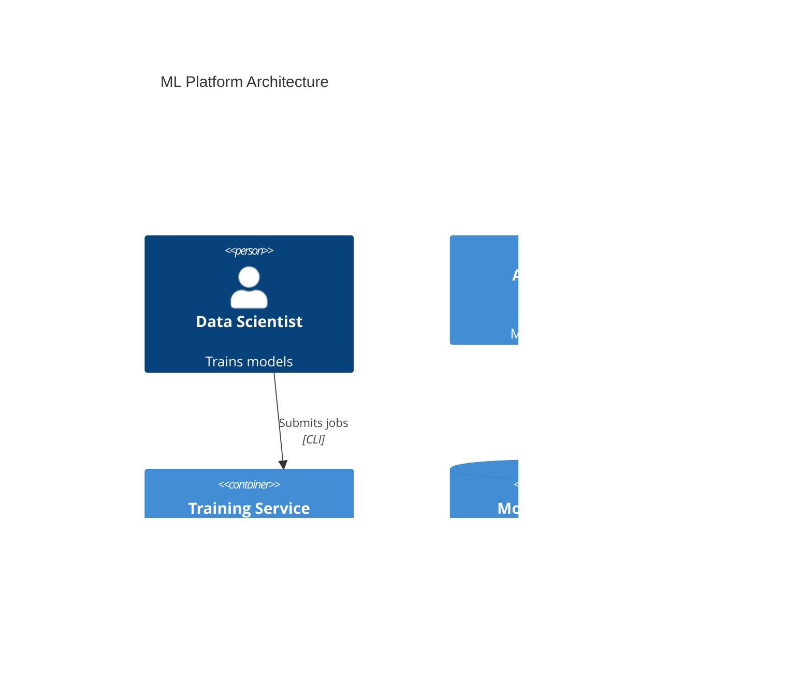

# Generate Architecture Diagram

## Activated Agent

**Activate**: `mermaid-expert` agent

The agent will create appropriate Mermaid diagrams based on what needs visualization.

## Objective

Create clear, accurate Mermaid diagrams to visualize software architecture, data flow, system interactions, or other technical concepts.

## Activated Skills

The agent will activate these skills:

1. **`mermaid-diagramming`** - Mermaid syntax and diagram types
2. **`diagram-analysis`** - Understanding what to visualize and choosing diagram type

## Process

The agent will:

1. **Understand the need** - Ask:
   - What do you want to visualize?
   - Who is the audience?
   - What level of detail?
   - Any preferred diagram type?
   - **Output destination**: Insert into existing file or create standalone?

2. **Analyze the system** - Examine:
   - Project structure and architecture
   - Components and services
   - Data flow and interactions
   - Technologies in use

3. **Choose diagram type** - Select from:
   - C4 Context (system in environment)
   - C4 Container (services and tech)
   - Flowchart (processes, algorithms)
   - Sequence (interactions over time)
   - ER Diagram (data models)
   - Class (OOP structure)
   - State (entity lifecycles)

4. **Generate diagram** - Create:
   - Valid Mermaid syntax (basic and styled versions)
   - Clear labels and relationships
   - Appropriate level of detail
   - Focused scope

5. **Output diagram**:
   - **If standalone**: Create new .md file at specified location
   - **If insertion**: Read target file, insert diagram at specified location (line number or after section heading)

6. **Provide usage** - Explain:
   - How to embed in other documents
   - How to render/preview (GitHub, VS Code, mkdocs)
   - Suggested customizations

## Diagram Type Selection

| Type | Use For | Example |
|------|---------|---------|
| **C4 Context** | System overview | "How does our platform fit in the ecosystem?" |
| **C4 Container** | Service architecture | "What are our main services?" |
| **Flowchart** | Processes | "How does training work?" |
| **Sequence** | API interactions | "What happens during request?" |
| **ER Diagram** | Data models | "Database schema?" |
| **Class** | OOP design | "Class hierarchy?" |
| **State** | Lifecycles | "Deployment states?" |

## Output Format

Provide:

1. **Diagram code** - Complete Mermaid syntax
2. **Explanation** - What the diagram shows
3. **Usage instructions** - How to use/render it
4. **Storage suggestion** - Where to save

Example output:

````markdown
Here's a C4 Container diagram showing your ML platform architecture:



**To use this diagram:**
- Embed in Markdown files (GitHub will render it)
- Preview in VS Code with Mermaid extension
- Save to `docs/architecture/platform-overview.md`
````

## Constraints

- **Valid syntax**: Ensure Mermaid renders correctly
- **Evidence-based**: Reflect actual architecture
- **Focused scope**: One concern per diagram
- **No sensitive data**: Exclude credentials, IPs
- **Clear labels**: Use descriptive names

## Output Options

**Standalone file**:
- Create new .md file with diagram
- Default location: `docs/architecture/[diagram-name].md`
- File renders in GitHub automatically

**Insert into existing file**:
- Ask for file path to insert into
- Ask for insertion point (line number or section heading like "## Architecture")
- Read file first to understand context
- Insert diagram at specified location
- Preserve existing content
