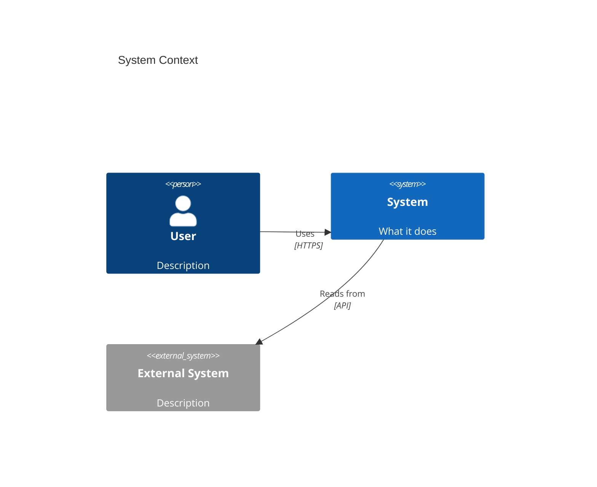
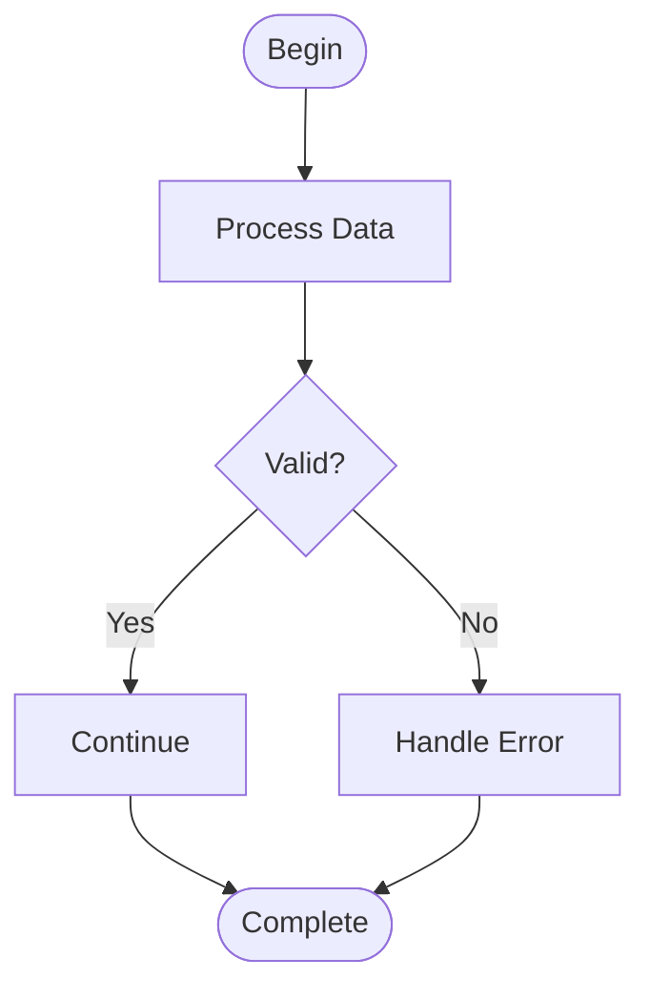
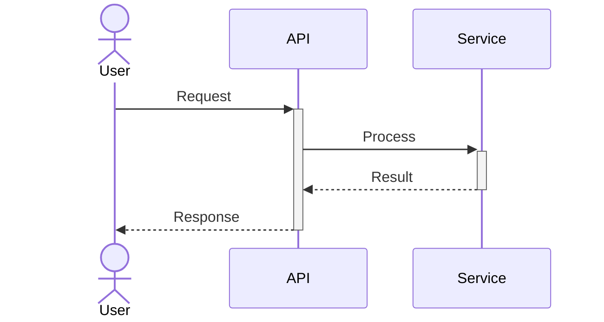
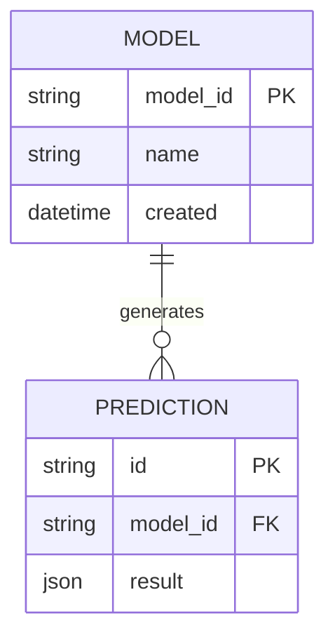
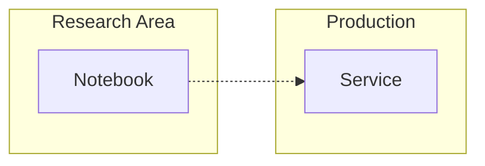

# Mermaid Diagramming

## Metadata

**Purpose**: Mermaid syntax reference and best practices for all diagram types
**Version**: 1.0.0

---

## Diagram Type Selection

| Diagram Type | Use When | Example Use Case |
|-------------|----------|------------------|
| **C4 Context** | System in environment | "How does our ML platform fit in the org?" |
| **C4 Container** | Services and tech stack | "What are our main services?" |
| **Flowchart** | Process flow, algorithms, decision trees | "How does model training work?" |
| **Sequence** | Interactions over time, API calls | "What happens during API call?" |
| **ER Diagram** | Database schemas, data models | "What's the feature store structure?" |
| **Class** | OOP design, inheritance | "What's our model class hierarchy?" |
| **State** | Entity lifecycles, state machines | "Model deployment states?" |
| **Gantt** | Project timelines, schedules | "Release timeline?" |
| **Journey** | User journeys, experiences | "User onboarding flow?" |
| **Git Graph** | Branching strategies | "Release workflow?" |

## Syntax Examples

### C4 Context Diagram


### Flowchart


### Sequence Diagram


### ER Diagram


## Best Practices

**Clarity**:
- Use descriptive labels
- Keep diagrams focused (one concern)
- Avoid clutter
- Add legends if needed

**Styling**:
- Consistent naming
- Logical flow direction
- Group related items
- Use color sparingly

**Maintainability**:
- Add comments for complex parts
- Structure code clearly
- Make updates easy

## Common Patterns

**Direction**:
```
flowchart TD    # Top-Down
flowchart LR    # Left-Right
flowchart BT    # Bottom-Top
flowchart RL    # Right-Left
```

**Node shapes** (flowchart):
```
[Rectangle]
(Rounded)
([Stadium])
[[Subroutine]]
{Diamond}
```

**Relationships** (sequence):
```
->>  Solid arrow
-->> Dotted arrow
->>+ Activate
-->>- Deactivate
```

## Styling and Theming

**Standard colors for personal use diagrams**:
```
style Research fill:#fff4e6     # Light orange - research/experimental
style Production fill:#e6f3ff   # Light blue - production/library
style Data fill:#e6ffe6         # Light green - data stores
style External fill:#ffe6e6     # Light red - external systems
```

**Subgraphs for boundaries**:


**Provide both versions**:
- Basic: Clean diagram without styling
- Styled: With colors, themes, and visual enhancements

## Alignment with Repo-Investigator

When visualizing data/information flow (similar to `/repo-investigator:visualize-flow`):
- Use **subgraphs** to distinguish Research vs Library boundaries
- Use **dotted arrows** (-.->) for hand-off/promotion paths
- Follow same color scheme: orange for research, blue for production
- Show data sources, transformations, outputs, and consumers
